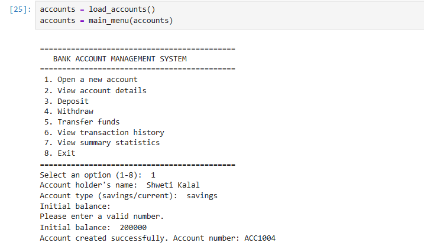
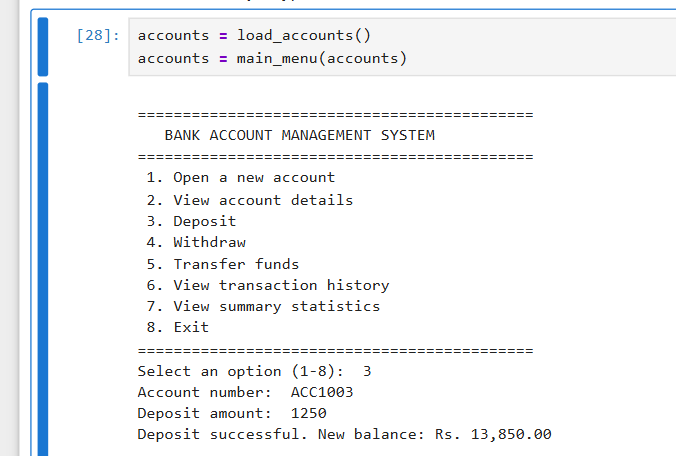
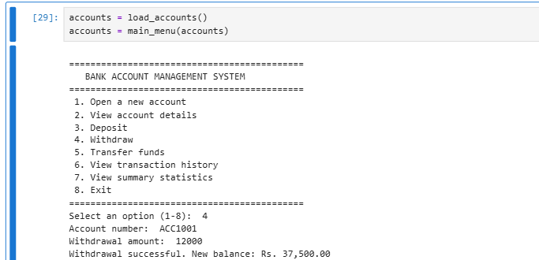
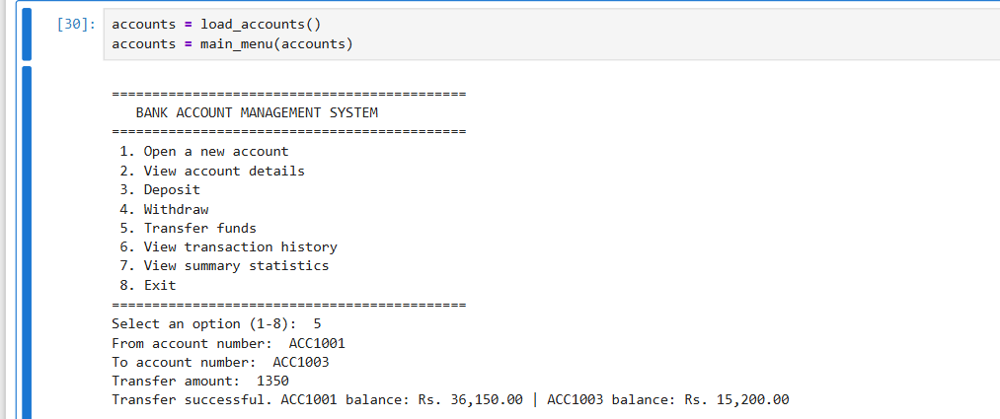
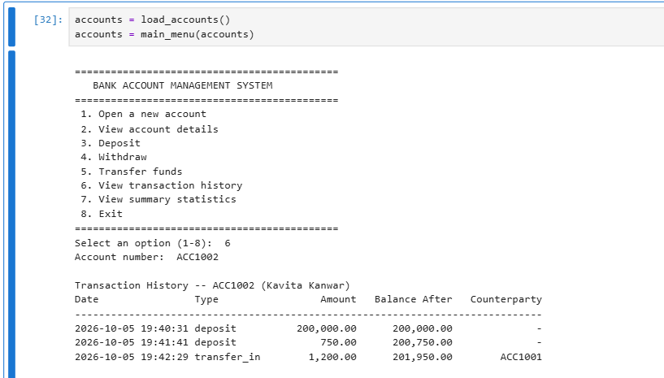
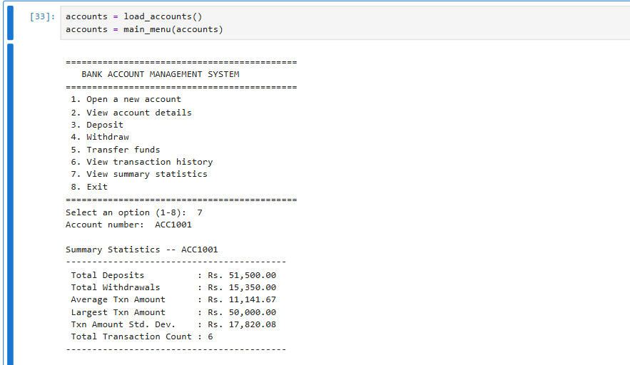

# Banking Account Management System

A menu-driven banking application built in Python as a learning project. It lets a user create bank accounts, deposit, withdraw and transfer money, view transaction history, and see summary statistics for each account. Account data is saved to a local file, so it is still there the next time the program runs.

The project uses NumPy for account-level summary statistics and includes a Pandas function that converts all transactions into a DataFrame for grouped analysis.

---

## Table of Contents

- [Features](#features)
- [Technologies and Python Concepts](#technologies-and-python-concepts)
- [Project Structure](#project-structure)
- [Notebook vs Python Script](#notebook-vs-python-script)
- [How the System Works](#how-the-system-works)
- [Data Storage](#data-storage)
- [Analytics Component](#analytics-component)
- [Installation](#installation)
- [How to Run](#how-to-run)
- [Screenshots](#screenshots)
- [What This Project Demonstrates](#what-this-project-demonstrates)
- [Limitations](#limitations)

---

## Features

- Create a new savings or current account with an initial balance
- Auto-generated account numbers (`ACC1001`, `ACC1002`, and so on)
- View account details (holder name, account number, type, balance, number of transactions)
- Deposit money
- Withdraw money, with a check that the amount does not exceed the balance
- Transfer funds between two accounts
- View the transaction history of an account
- View summary statistics for an account using NumPy
- Input validation and custom error messages for invalid operations
- Password check function for authentication
- Account data saved to and loaded from a local pickle file
- Interactive menu loop to move between operations

---

## Technologies and Python Concepts

**Language:** Python 3

**External libraries**

| Library | Used for |
| ------- | -------- |
| NumPy | Summary statistics (sum, mean, max, standard deviation) on transaction amounts |
| Pandas | Converting all transactions into a DataFrame and grouping them by account and transaction type |

**Standard library modules:** `pickle`, `os`, `dataclasses`, `datetime`, `typing`

**Python concepts practiced**

- Functions with type hints and docstrings
- Classes and `@dataclass` (`Account` and `Transaction`)
- Custom exceptions (`BankError`, `AccountNotFoundError`, `InvalidAmountError`, `InsufficientFundsError`, `AuthenticationError`)
- Dictionaries as the main data store (account number to `Account` object)
- File handling with `pickle`
- Input validation and error handling with `try` / `except`
- Lambda functions for quick transaction filters
- Loops and conditional statements for the menu-driven interface

---

## Project Structure

```text
Banking-System/
├── Banking_System.ipynb
├── banking_system.py
├── requirements.txt
├── .gitignore
└── screenshots/
    ├── account_creation.png
    ├── deposit_transaction.png
    ├── withdrawal_transaction.png
    ├── fund_transfer.png
    ├── transaction_history.png
    └── summary_statistics.png
```

| File / Folder | Description |
| ------------- | ----------- |
| `Banking_System.ipynb` | Jupyter Notebook with the full project code, a sample run, demo outputs and the Pandas analysis |
| `banking_system.py` | The executable Python application with the interactive menu |
| `requirements.txt` | Python libraries needed to run the project (`numpy`, `pandas`) |
| `.gitignore` | Keeps generated files such as the local `.pkl` data file out of the repository |
| `screenshots/` | Screenshots of the program in use |

---

## Notebook vs Python Script

Both files are based on the same project and use the same functions and logic.

- **`Banking_System.ipynb`** is the learning and demo version. Alongside the code it contains a sample run that creates accounts, performs transactions, shows error handling, saves and reloads data, runs a simulated menu session, and ends with the Pandas analysis.
- **`banking_system.py`** is the clean script version. It contains the application code without the notebook demo cells, and starts the interactive menu when run.

---

## How the System Works

### Workflow

1. The program loads existing accounts from the local data file. If no file exists, it starts with an empty store.
2. The main menu is shown and the user picks an option (1 to 8).
3. The selected operation runs. Invalid input or failed operations show an error message instead of stopping the program.
4. Accounts are saved to the data file after each menu action, and again when the user chooses Exit.

### Menu options

| Option | Action |
| ------ | ------ |
| 1 | Open a new account |
| 2 | View account details |
| 3 | Deposit |
| 4 | Withdraw |
| 5 | Transfer funds |
| 6 | View transaction history |
| 7 | View summary statistics |
| 8 | Exit (saves data) |

### How transactions are handled

- Every amount is validated first. It must be a number, finite, and greater than zero, and it is rounded to two decimal places.
- **Deposit** increases the balance and records a `deposit` transaction.
- **Withdraw** raises an `InsufficientFundsError` if the amount is more than the balance; otherwise it reduces the balance and records a `withdrawal` transaction.
- **Transfer** checks that both accounts exist, that they are different, and that the sender has enough balance. Only after these checks does it update both balances, recording `transfer_out` for the sender and `transfer_in` for the receiver, each with the other account number as the counterparty.
- Each transaction record stores the timestamp, type, amount, balance after the transaction, and counterparty (for transfers).
- Opening an account with an initial balance above zero records that balance as the first deposit.

### Error handling

Custom exceptions make failures easy to identify, for example:

- Account not found
- Invalid amount (negative, zero, or not a number)
- Insufficient funds
- Incorrect password

### Authentication

The code includes an `authenticate()` function that checks an account's password and raises an `AuthenticationError` when the password is missing or incorrect. Accounts have optional `username` and `password` fields. The menu itself does not currently ask for a login.

---

## Data Storage

Account data is stored locally in a pickle file named `bank_data.pkl`.

- The data is a dictionary of `Account` objects, each holding its own list of `Transaction` objects, so balances and history are saved together.
- The file is loaded when the program starts and saved after each menu action and on exit.
- If the file is missing, the program starts with an empty store. If it cannot be read, the program shows a warning and starts empty instead of crashing.
- When saving, the data is first written to a temporary file and then swapped in, which avoids leaving a half-written data file.
- `bank_data.pkl` is created when you run the program. It is excluded by `.gitignore` and is not part of the repository.

---

## Analytics Component

### NumPy: account summary statistics

For each account, transaction amounts are collected into NumPy arrays and used to calculate:

- Total deposits
- Total withdrawals (including transfers sent out)
- Average transaction amount
- Largest transaction amount
- Standard deviation of transaction amounts
- Total transaction count

These are available from menu option 7.

### Pandas: transaction analysis

The `transactions_to_dataframe()` function converts the transactions of all accounts into a single Pandas DataFrame with these columns: account number, holder name, account type, timestamp, transaction type, amount, balance after, and counterparty.

In the notebook, this DataFrame is used for a grouped analysis of total amounts per account and transaction type with `groupby`. This part is in the notebook and is not an option in the menu.

---

## Installation

Make sure Python 3 is installed, then download or clone this repository and open a terminal in the project folder:

```bash
cd Banking-System
```

Install the required libraries:

```bash
pip install -r requirements.txt
```

`requirements.txt` contains:

```text
numpy
pandas
```

---

## How to Run

### Python script

```bash
python banking_system.py
```

The menu appears in the terminal. Choose an option by entering its number. A `bank_data.pkl` file is created in the folder you run the script from.

### Jupyter Notebook

Open `Banking_System.ipynb` in Jupyter Notebook, JupyterLab or VS Code and run the cells from top to bottom to see the sample run and analysis outputs.

---

## Screenshots

### 1. Account Creation
Opening a new savings or current account from the menu. An account number is generated automatically.



### 2. Deposit Transaction
Depositing money into an existing account and viewing the updated balance.



### 3. Withdrawal Transaction
Withdrawing money from an account, with the balance updated after the transaction.



### 4. Fund Transfer
Transferring money from one account to another and viewing the balances of both accounts afterwards.



### 5. Transaction History
Viewing the recorded transactions of an account, including date, type, amount, balance after the transaction and counterparty.



### 6. Summary Statistics
NumPy-based statistics for an account: total deposits, total withdrawals, average, largest and standard deviation of transaction amounts, and transaction count.



---

## What This Project Demonstrates

- Breaking a real-world process (banking) into clear functions and data models
- Storing structured records using dataclasses and dictionaries
- Keeping the data consistent, for example by validating both accounts and the balance before a transfer changes anything
- Saving and loading Python objects with file handling
- Handling errors with custom exceptions and clear messages
- Using NumPy to calculate summary statistics on transaction data
- Using Pandas to turn transaction records into a table for grouped analysis
- Building a menu-driven program that runs in a loop

---

## Limitations

This is a learning project, and it is kept simple on purpose:

- Data is stored in a local pickle file, not in a database.
- Passwords are stored as plain text and are not encrypted.
- The menu does not require a login, although the authentication function is in the code.
- It is designed for a single user running it on their own machine, not for multiple users at the same time.
- The Pandas analysis runs in the notebook only and is not part of the menu.

---

## Contact & Profile

**Kavita Kanwar Naruka**  
Email: [kavita.kanwar1190@gmail.com](mailto:kavita.kanwar1190@gmail.com)  
LinkedIn: https://www.linkedin.com/in/kavita-kanwar1190/
